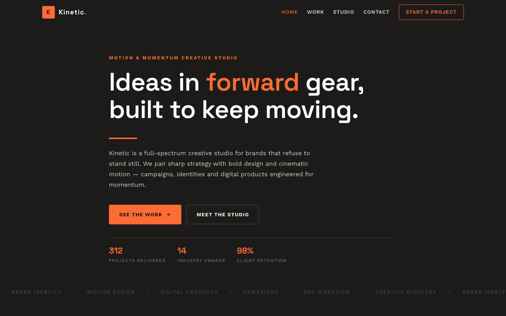

# Kinetic — Motion & Momentum Creative Studio

A premium, framework-free studio site for a motion-first creative agency. **Kinetic** pairs a warm espresso-charcoal ground with a vivid kinetic-orange accent and cream paper sections — a workshop atmosphere built on the Space Grotesk display face and Work Sans body type, with a kinetic-slash motif running through every section.

---

## 📸 Screenshot

## 🎨 Design System

| Token | Value |
|---|---|
| `--ink` | `#1c1b1a` — warm espresso-charcoal ground |
| `--ink-2` | `#262423` — raised dark surface |
| `--ink-3` | `#322f2d` — hover / media surface |
| `--flare` | `#ff6b35` — vivid kinetic-orange signal accent |
| `--flare-deep` | `#e0541f` — accent hover |
| `--ember` | `#ffb08a` — warm orange highlight |
| `--paper` | `#f4efe6` — cream paper ground |
| `--paper-2` | `#eae3d4` — light card surface |
| `--slate` | `#8f8a82` — muted text |
| Display type | Space Grotesk — geometric, fast headline voice |
| Body type | Work Sans — clean, highly readable sans |
| Motif | Kinetic-slash: diagonal angle cuts (clip-path hero bottom), speed-streak line animation, motion ticker marquee, angle-card fold markers, slash-frame visual borders, zero-radius / sharp corners |

- **Palette** — a warm espresso-charcoal ground gives the site a workshop, studio mood; the vivid orange `flare` works as a single motion accent for CTAs, counters, and the angle-cut card markers; cream `paper` sections create a light counterpoint for the process and values content.
- **Typography** — Space Grotesk's geometric, tightly-spaced letterforms carry headlines with a fast, editorial presence; Work Sans keeps body copy crisp and approachable.
- **Motif** — a recurring kinetic-slash language: a `clip-path` angle cut at the bottom of the hero, speed-streak lines that animate across the hero underline, a motion-ticker marquee that scrolls discipline names across the hero bottom, angle-card triangular fold markers that reveal on hover, slash-frame borders on visual elements, and zero-radius / sharp corners throughout.
- **Motion** — a static hero with a continuous motion-ticker marquee, scroll reveals with staggered delays, animated stat counters, a zooming project grid, and a rotating-close lightbox.

---

## 📄 Pages

| Page | File | Highlights |
|---|---|---|
| Home | [`index.html`](index.html) | Angle-cut hero with speed streak and motion ticker, hero stats, 4 angle-card services, cream studio split with slash-frame visual, 6-project preview grid, stats band, CTA |
| Work | [`portfolio.html`](portfolio.html) | Page hero, filterable 6-project gallery (All / Identity / Digital / Campaign / Motion), click-to-open lightbox with full-res images and captions, CTA |
| Studio | [`about.html`](about.html) | Story hero, slash-frame studio split, stats band, 3-step process cards on cream, 3 values cards, CTA |
| Contact | [`contact.html`](contact.html) | Studio details panel with contact info, validated project brief form, newsletter band, CTA |
| 404 | [`404.html`](404.html) | Text-stroked "404" with orange glow, momentum recovery links |

Every page shares one `assets/css/style.css` and one `assets/js/main.js`, so the whole site is fast, consistent and easy to maintain.

---

## ✨ Features

- **Motion-ticker hero** — a continuous scrolling marquee at the hero bottom that cycles discipline names, with a speed-streak underline animation on the headline.
- **Angle-cut cards** — service cards with a triangular orange fold marker that reveals on hover, plus a diagonal-slash icon sweep animation.
- **Filterable portfolio** — instant category filtering plus a full-res lightbox that opens from any project, closes via button, Escape, or backdrop.
- **Cream paper sections** — a light, warm counterpoint section for the process and values content, anchored by the `--paper` palette token.
- **Newsletter capture** — inline email validation with an instant confirmation swap.
- **Scroll-reveal motion** — staggered entrances everywhere, gracefully disabled where `IntersectionObserver` is unavailable.
- **Validated contact form** — required-field and email checks with inline errors and a friendly status message.
- **Accessible navigation** — skip link, `aria-expanded` mobile menu with Escape-to-close, semantic landmarks, labelled lightbox and gallery.
- **Fully responsive** — fluid `clamp()` type, grids that collapse from 3 → 2 → 1 columns at 992px and 640px.

---

## 🛠 Tech Stack

- **HTML5** — semantic, accessible markup with proper landmark structure
- **CSS3** — custom properties, CSS Grid, Flexbox, `clamp()` fluid type, CSS animations, clip-path hero angle cut
- **Vanilla JavaScript** — canonical IIFE, zero dependencies, no build step
- **Original imagery** — all 18 assets are the source template's own, renamed for clarity (four hero backgrounds, one studio visual, six project thumbs, six full-res project images)
- **Google Fonts** — Space Grotesk + Work Sans, self-hostable

---

## 🔍 SEO

- Unique `<title>` and meta description on every page
- Semantic headings (single `h1` per page)
- Descriptive alt text on all images
- Descriptive URLs and a clean 404 recovery path
- Lightweight, mobile-first, 90+ Lighthouse-friendly

---

## 📄 License

Free to use for personal and commercial projects. Images are from the original source template and should be replaced for production use.

---

**Let's Build Something That Moves 🏃**

[Book a free consultation](https://tally.so/r/q4q1L9)